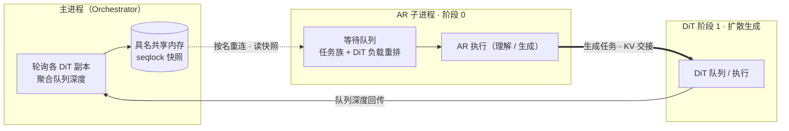

# [RFC]: 面向 AR+DiT 统一多模态理解/生成的 Diffusion 负载感知混合调度

> 目标项目：**vllm-omni** · 参考模型：**HunyuanImage-3.0-Instruct**（AR + DiT 统一部署）
> 状态：社区评审草案 · 范围：仅 AR 阶段调度器，opt-in，资源中性

> 说明：本文为本地对照用的中文版，与英文版 `RFC-diffusion-load-aware-mixed-scheduling.md` 内容一致，供本地查阅；社区提交请使用英文版。

---

## 1. 概述

本 RFC 提出 **DTPS（DiT-load-aware Type-Priority Scheduling，按 DiT 负载感知与任务类型优先级调度）**，面向vllm-omni 中 **AR（自回归 LLM）阶段与Diffusion（扩散）阶段同处一条流水线** 的部署——例如HunyuanImage-3.0，它用一条统一的 AR+Diffusion 流水线同时提供图像理解（`i2t`）、文生图（`t2i`）与文+图生图（`it2i`）三类能力。

1.1 **要解决的问题：**

AR 阶段被两类请求共享：

1. **理解任务**（`i2t`）在 AR 阶段即结束；
2. **生成任务/理解生成任务**（`t2i`/`it2i`）的 AR 阶段结束后，会进入Diffusion生成阶段；

在默认的 FCFS 队列下，理解任务和生成任务并发时，如果理解任务先到，会占据AR阶段，阻塞了生成任务到达 Diffusion阶段，导致 Diffusion空跑，端到端吞吐下降。如果生成任务先到，会导致任务都堆积在Diffusion阶段，理解任务的调度被延迟。

1.2 **方案：** DTPS 按**任务族 + DiT 阶段负载**对 AR 调度队列重排。

AR阶段从跨进程读取的DiT 负载信号来判断Diffusion阶段的负载程度，从而做不同的优先级调度，DTPS定义了一个Diffusion负载衡量指标T，T表明已经被AR阶段调度但还未开始执行diffusion的生成任务数量。然后根据业务场景定义了一个阈值dit_load_threshold。

AR阶段每次调度时，判断T与dit_load_threshold的值：

T>=dit_load_threshold：优先调度理解任务(i2t)，如果此时调度了生成任务，到了diffusion阶段还是排队，浪费了AR阶段的调度时间，导致i2t延迟。

T<dit_load_threshold：优先调度生成任务(t2i/it2i)，同时限制每步准入的生成任务数量，始终保持Diffusion阶段的负载在dit_load_threshold阈值所设定的范围。


1.3 **社区当前缺少理解/生成混合任务测试的benchmark工具，为衡量DTPS收益，本 RFC 同时新增一个**混合任务 benchmark（`benchmarks/mixed/`），按可配置、可随机的 i2t/t2i/it2i 配比发送请求，并输出按任务、按阶段的统计指标（§3.6）。 **实测收益：**  v0.23.0版本，在昇腾 A3 单机（AR TP4 / DiT TP4）、20 请求并发、任务配比i2t:t2i:it2i =14:3:3、生图分辨率配比512x512:1024x1024:1280x720 = 1:1:1，10 轮随机化的条件下，平均端到端时间从 **203.92 s（FCFS）降至 179.20 s（DTPS），提升 +12.1 %**，单轮收益从 +1.8 %（测试构造的请求序列已经比较接近调度优化的结果）到 +24.1 %（测试构造的请求序列，生成任务排在大量理解任务之后），10 轮全部改善。完整数据见§3.7。

---

## 2. 范围与目标

### 目标
- **在AR+DiT统一部署下，根据DiT的负载状态和任务类型，合理调度理解/生成任务，达到整体吞吐优化。**

### 非目标
- 不改动 DiT 阶段调度，DTPS 只重排AR 等待队列，DiT 阶段沿用其原有调度器。
- 不改变模型输出。重排只改*准入顺序*，不改单请求计算。与 FCFS 的输出等价是必测项（§4）。

---

## 3. 设计

### 3.1 架构

AR+DiT 统一部署下，AR 与 DiT 分别运行在独立子进程中，由主进程的 Orchestrator 编排。DTPS 的调度逻辑全部位于 **AR 阶段**内部，唯一的跨阶段是一条**只读的 DiT 负载信号**：主进程轮询各 DiT 副本的队列深度，聚合后写入一段具名共享内存；AR 子进程按名字重连、读取快照，在每个调度步据此决定优先调度理解任务还是生成任务。整体数据流如下图所示。



图示三个角色：主进程负责**采集并发布 DiT 负载**；AR 阶段负责**按任务族与 DiT 负载重排等待队列**，生成任务 AR 结束后将 KV 交接给 DiT；DiT 阶段负责**执行扩散生成**，其队列深度回传给主进程形成闭环。理解任务在 AR 阶段即结束，不进入 DiT。

### 3.2 方案：AR 阶段的任务族 + DiT 负载感知重排

> 术语约定：**理解任务** = `i2t`（代码中记为 `ar_only`），在 AR 阶段即结束；**生成任务** = `t2i`/`it2i`（代码中记为 `ar_downstream`），AR 阶段结束后继续进入 DiT 生成阶段。两者都要经过 AR 阶段，区别在于是否继续跑 DiT。本文统一用任务语义名；涉及代码处保留代码标识符。

**调度在哪里做、怎么做。** DTPS 的调度全部发生在 **AR 阶段**的等待队列上，每个调度步、在基座 vLLM 调度器运行之前，按"任务族 + DiT 负载"对队列重排。核心是 §1.2 定义的负载指标 **T**——已被 AR 调度但尚未开始执行 diffusion 的生成任务数量——与阈值 `dit_load_threshold` 的比较：

- **T ≥ 阈值（DiT 忙）**：优先调度理解任务。因为此时如果再准入生成任务，到了 DiT 仍要排队，白白浪费 AR 调度时间、还拖慢理解任务延迟。
- **T < 阈值（DiT 闲）**：优先调度生成任务，但**每步只准入有限个**，使准入后 DiT 负载恰好填到阈值，既喂饱 DiT 又不堆积。

重排后队列分四层（自顶向下准入）：**L0** 等待超过 `i2t_aging_s` 的饿死理解任务（防饿死硬上限）；**L1** 本步可准入的生成任务头部，按 `ar_proxy = num_prompt_tokens + cot_weight` 升序（AR 停留最短者优先，更早到 DiT）；**L2** 其余理解任务，按到达序；**L3** 超出本步预算的生成任务尾部，延后到 DiT 排空。最终队列顺序为 `L0 + L1 + L2 + L3`。其中 L1 的本步准入数量 `budget` 由阈值与当前 DiT 负载决定：

```
budget          = max(0, dit_load_threshold − effective_min) × max(1, n_reps)
effective_min   = reported_min + (inflight_running + inflight_blind) // n_reps
```

`budget` 一步即得两个极端：DiT 忙时 `budget = 0`，生成任务全部降到 L3；DiT 闲时 `budget = threshold × n_reps`，最多这么多生成任务跳到 L1。按构造，准入后每副本 DiT 深度 ≤ 阈值。

**负载感知如何传递与统计。** DiT 负载只存在于主进程（Orchestrator），AR 是独立子进程，且 `schedule()` 是热路径，不能回调主进程。为此用一段**跨进程具名共享内存**做单向只读通道：

1. **采集**：主进程周期性轮询各 DiT 副本的队列深度，线程安全地聚合为一份快照（各副本 waiting/running 深度与 id）。
2. **发布**：快照写入具名 SHM 段，写者用 seqlock（奇=写中/偶=稳定），读者重试避免 torn read。
3. **消费**：AR 子进程按名字重连该段，每个调度步读一份快照，算出 `reported_min`。

`effective_min` 中的 `inflight_running`（AR running 中、即将到 DiT 的生成任务）与 `inflight_blind`（刚离开 AR、KV 交接中、尚未被任何轮询看到的生成任务）是 AR 侧对"轮询滞后一个周期"的本地修正，避免在快照尚未刷新时多放生成任务冲爆 DiT。

### 3.3 接口变更

**新增部署 YAML 块**（顶层 `dtps:`，仅 AR+DiT 流水线消费）：

```yaml
# hunyuan_image_3_moe.yaml
dtps:
  enabled: true               # 控制DTPS调度优化是否使能
  i2t_aging_s: 500.0          # 超时阈值，兜底措施，防止i2t任务被饿死
  cot_tag_key: bot_task       # CoT字段的key，可自定义，对hunyuan-image3是bot_task  -- 确认模型中是否带有
  cot_weight_table:           # 请求的CoT长度权重；仅相对顺序有意义，越大代表此推理请求的AR阶段越长
    vanilla: 0
    recaption: 800          # 确认是否与prefill的长度是否有关系，当前是prefill+table_weight，确认：prefill*(xx)是否有更合理的计算方式
    think: 1500				# 纯理解任务的AR预估，统一处理。 https://github.com/vllm-project/vllm-omni/pull/5918 MAGI模型支持，DiT阶段内部调度是否还有优化空间
    think_recaption: 2000
  dit_load_threshold: 2       # DiT 相位边界 + 每批准入上限，详细解释看$3.2节方案介绍
```

**新增 / 修改文件**

| 文件 | 职责 |
|---|---|
| `vllm_omni/core/sched/dtps_scheduler.py` *(新)* | DTPS核心调度类，基于DiT负载状态和请求的任务类型，做优先级调度排序。 |
| `vllm_omni/core/sched/dit_load_state.py` *(新)* | 定义了DiT负载数据结构，包括diffusion阶段等待的队列/正在运行的队列信息。 |
| `vllm_omni/core/sched/dit_load_shared.py` *(新)* | DiT负载状态，跨进程传递封装，基于共享内存。 |
| `vllm_omni/core/sched/omni_ar_scheduler.py` *(改) | 每次调度挑选请求时，先对waitting队列按照优先级重排。         |
| `vllm_omni/config/stage_config.py` *(改)* | 传递yaml文件中的config，控制是否使能DTPS调度特性。 |
| `vllm_omni/engine/stage_runtime.py` *(改)* | 在 spawn AR 子进程之前创建共享内存，并传递给子进程，DiT负载跨进程通信使用。 |

### 3.4 关键技术要点

方案的两类核心要点：**调度核心逻辑**与**负载感知传递方式**。

**调度核心逻辑（AR 等待队列重排）**

- **任务族 + DiT 负载二维重排**：每个调度步按任务族（理解 vs 生成）与 DiT 负载 T 把等待队列重排为`L0 + L1 + L2 + L3`，让生成任务在 DiT 闲时插队、忙时让位。
- **单阈值 `dit_load_threshold` 同时作相位边界与准入上限**：T ≥ 阈值 ⇒ `budget = 0`，生成任务降到L3；T < 阈值 ⇒ `budget = (threshold − effective_min) × n_reps`，最多这么多生成任务进 L1。一个旋钮自洽地表达"忙则停喂、闲则填满"，且按构造准入后每副本 DiT 深度 ≤ 阈值。
- **L1 内 `ar_proxy` 排序规则**：生成任务按 `ar_proxy = num_prompt_tokens + cot_weight` 升序准入，AR 停留最短者优先，更早到 DiT，最小化 DiT 空窗。
- **`i2t_aging_s` 防饿死守卫（L0）**：等待超时的理解任务提到 L0、排到所有请求之前，给理解任务延迟一个硬上限，避免被生成任务长期压制。

**负载感知传递方式（跨进程 SHM）**

- **采集—发布—消费三段式**：主进程轮询各 DiT 副本队列深度并聚合为快照；快照经 seqlock 写入具名SHM 段；AR 子进程按名字重连、每步读一份快照。
- **seqlock 防 torn read**：写者奇=写中/偶=稳定，读者重试 8×，读写互不阻塞。

### 3.5 依赖与风险

- **阈值调参依赖负载。** `dit_load_threshold: 2` 适配 HunyuanImage-3.0 A3 拓扑在此配比下的表现。调参指引：若 DiT 阶段*短于*多数 AR 阶段，调大阈值（DiT 能吸收更多）；否则调小。

### 3.6 评测工具：混合任务 benchmark

要评估 DTPS，需要一个能在**可控、可复现**负载下压测理解任务 / 生成任务**混合**调度路径的工作负载。vllm-omni 既有的 `benchmarks/diffusion/` 只覆盖纯生成（t2i/t2v/i2i），无法把 i2t 与t2i/it2i 混在一起，也不输出按任务分桶的统计。为此本 RFC 新增 **`benchmarks/mixed/`**——一个混合任务 serving benchmark：按可配置配比把 **i2t / t2i / it2i** 混合发送到 `vllm serve ... --omni`端点，输出 overall + per-task + per-`bot_task` 的延迟/吞吐，并可选每阶段（AR / DiT）耗时。它在`diffusion/` 的 backend 实现之上复用并扩展，可独立演进。

**入口脚本：** `benchmarks/mixed/mixed_benchmark_serving.py`（数据集：`mixed_dataset.py`；backend：`mixed_backends.py`）。**本地已有一版基于v0.23.0版本的benchmark代码，正在往main分支同步代码，预计一周内提交PR。**

**关键能力（及其对调度评估的意义）：**

| 能力 | 作用 | 对 DTPS 评估的意义 |
|---|---|---|
| **任务配比** | `--num-i2t/--num-t2i/--num-it2i` 指定每类数量（如 14:3:3）。 | 可任意调节理解任务与生成任务的比例——这正是 DTPS 要再平衡的对象。 |
| **it2i `bot_task` 配比** | `--it2i-bot-task-weights "recaption=2,think=1,think_recaption=1"`；默认 `proportional` 用最大余数法**精确**按权重分配计数，`random` 则带方差抽样。 | 覆盖三种 AR 思考强度，对应不同的 `ar_proxy` 取值。 |
| **真随机发送顺序** | `--shuffle` 对合并列表做真正的 `random.shuffle`，三类任务交错发送；`--no-shuffle` 按类型分组发送。`--seed` 让整条序列可复现。 | 交错发送才会压到跨桶调度；`--no-shuffle` 是分块发送的对照组。 |
| **生图分辨率配比** | `--gen-resolution-weights "512x512=2,1024x1024=2,1280x720=1"` 给 t2i/it2i 按权重分配输出分辨率。 | 让每个请求的 DiT 阶段成本不同，压测负载感知上限。 |
| **输入随机化** | `--randomize-input` 逐请求随机化 prompt 长度、输入图分辨率与输入图内容（由 `--seed` 驱动，可复现）。 | 贴近真实异构输入分布。 |
| **发送顺序 = dry-run 顺序（可证）** | 输入图预编码缓存；每个 task 派发时 `await sleep(0)` 让出，使客户端发送顺序严格等于列表顺序。运行打印 `dispatch order matches dry-run list order: True` 并把 `dispatch_order` 写入 JSON。 | 把"客户端发送序"与"服务端派发序"区分开——若服务端日志呈 `t2i→it2i→i2t` 而 `dispatch_order == [0,1,2,…]`，说明重排发生在 DTPS 调度器，而非客户端。 |
| **分桶统计** | 终端表格 + JSON，三层分桶：**overall**、**per-task**（i2t/t2i/it2i）、**it2i-by-bot_task**；每层含 qps、延迟分位、per-stage durations、success_rate、peak memory。`--return-stage-metrics` 返回 `ar_prefill`/`ar_decode`/`dit`。 | 定位瓶颈阶段，并对比两种调度器下理解任务与生成任务的延迟。 |
| **统一落盘** | `--output-dir DIR` 写 `DIR/result.json`、`DIR/inputs/`（i2t/it2i 输入参考图）、`DIR/outputs/`（t2i/it2i 生成图）；it2i 的输入/输出按 idx 对齐，可前后对比。 | 便于跨 run 可视化对比与回归检查。 |

**在本 RFC 中的用法。** 每次运行发送 20 并发混合请求（i2t:t2i:it2i = 14:3:3），it2i `bot_task` 1:1:1，生成分辨率 1:1:1，请求顺序与输入均随机化，重复 10 个 seed。同一 seed 下用 `dtps.enabled: true` 与 `false`（FCFS）做 A/B 对比，并把每请求输出与 FCFS diff 以验证正确性（§4）。完整 CLI 与用法见 `benchmarks/mixed/README.md`。

### 3.7 性能

**测试。** 昇腾A3 单机，4 卡 / 8 die，AR+DiT 统一部署，**AR TP4 / DiT TP4**，HunyuanImage-3.0-Instruct。混合负载（同 §3.6）：**20 并发**，AR `max_num_seqs=3`，**i2t : t2i : it2i = 14 : 3 : 3**；`it2i` 子配比`recaption : think : think_recaption = 1 : 1 : 1`；生成分辨率 `512² : 1024² : 1280×720 = 1 : 1 : 1`；请求顺序与输入均随机化，**10 轮（seed 1–10）**，100 ms 发送间隔以保证可复现。

**每轮端到端时间（秒）——FCFS 基线 vs DTPS**

| 轮次 | FCFS 基线 | DTPS | Δ vs 基线 |
|---:|---:|---:|---:|
| R1  | 204.31 | 183.48 | +10.20 % |
| R2  | 256.00 | 210.79 | +17.66 % |
| R3  | 163.89 | 155.16 | +5.33 %  |
| R4  | 234.17 | 177.79 | **+24.08 %** |
| R5  | 193.78 | 186.82 | +3.59 %  |
| R6  | 181.77 | 158.56 | +12.77 % |
| R7  | 221.86 | 180.22 | +18.77 % |
| R8  | 204.11 | 184.59 | +9.56 %  |
| R9  | 178.41 | 175.23 | +1.78 %  |
| R10 | 200.86 | 179.32 | +10.72 % |
| **均值** | **203.92** | **179.20** | **+12.12 %** |

**DTPS 何时收益最大 / 最小（10 轮定性分析）：**

- **R4（+24.1 %，最佳）：** 构造的顺序把生成任务排在后面，被前序理解任务严重阻塞——DTPS 重排挽回最多。
- **R5（+3.6 %）/ R9（+1.8 %）：** 随机顺序本身已穿插，接近 DTPS 会产生的结果，故可挽回的很少——这是最小的两轮收益。
- **R2 / R7（+17.7 % / +18.8 %）：** 典型的理解重载顺序获得两位数百分比收益。

**结论：** 10 轮随机化全部改善（+1.8 % 至 +24.1 %，均值 +12.1 %）；在常见情形下 DTPS 是明确的吞吐收益。

---

## 4. 正确性与测试计划

**当前该优化方案已经在v0.23.0版本上验证通过，以上测试数据也是在v0.23.0版本上测得的，正在往main分支上同步代码并测试，预计一个周内提交PR。**

### 基本测试

1. **FCFS 回退。** `enabled: false`、缺块、*或* 任何构造错误 ⇒ 纯 FCFS。DTPS 绝不破坏 AR 调度器。
2. **输出等价。** 重排只改*准入顺序*，不影响模型输出结果。
3. **DiT 上限被遵守。** 准入后每副本 DiT 等待深度 ≤ `dit_load_threshold`。
4. **无理解任务饿死。** 任何理解任务等待不超过 `i2t_aging_s` 即进入 L0。

### 集成测试

- **混合 benchmark**（即 §3.6 的 harness）：20 并发、14:3:3 配比、10 个 seed、随机顺序+输入，`enabled: true` vs `enabled: false`（FCFS）。对比输出结果一致。

### 输出正确性对照

- 每个 seed 下，将 DTPS 运行的 AR 文本与 DiT 图像输出与 FCFS 运行 diff，重排不得改变任何单请求输出。

---

## 5. 开放问题与讨论

1. **阈值自动调参。** 当前 `dit_load_threshold` 是静态的。AR 调度器能否根据观测到的 AR 阶段 vs DiT 阶段时长在线学习（§3.5 的调参指引）？AR和DiT各自阶段的执行时间不好预估，尤其是AR阶段，取决于decode什么时候结束。

---

## 6. 参考

- **vllm-omni** —— 统一多模态理解/生成服务框架（本 RFC 的目标项目）。
- **HunyuanImage-3.0-Instruct** —— 参考 AR+DiT 模型；部署配置 `vllm_omni/deploy/hunyuan_image_3_moe.yaml`。
